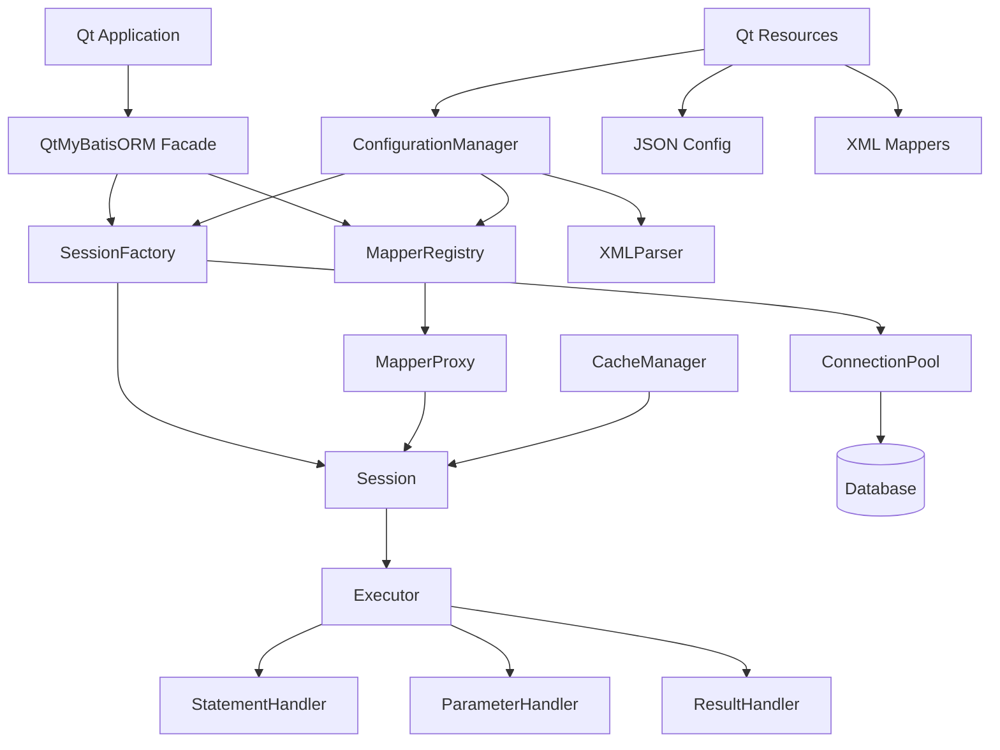

# Qt-MyBatis-ORM 设计文档

## Overview

Qt-MyBatis-ORM是一个基于Qt6框架的ORM组件，借鉴了Java MyBatis的设计理念和架构模式。该组件提供了简洁的数据库操作接口，支持XML配置的SQL映射，具备连接池管理和缓存机制，专门为Qt应用程序设计。

### 设计目标
- 提供类似MyBatis的简洁API
- 支持XML配置的SQL映射
- 实现高效的数据库连接池
- 提供灵活的缓存机制
- 与Qt6框架深度集成
- 支持MySQL兼容的数据库

## Architecture

### 核心架构图



### 分层架构

1. **应用层 (Application Layer)**
   - 用户代码调用DAO接口
   - 配置文件管理

2. **接口层 (Interface Layer)**
   - QtMyBatisORM主入口类
   - Mapper代理对象
   - Session接口

3. **核心层 (Core Layer)**
   - SQL执行引擎
   - 参数和结果映射
   - 事务管理

4. **基础设施层 (Infrastructure Layer)**
   - 数据库连接池
   - 缓存管理
   - 配置解析

## Components and Interfaces

### 1. 配置管理组件

#### ConfigurationManager
```cpp
class ConfigurationManager : public QObject
{
    Q_OBJECT
public:
    static ConfigurationManager* instance();
    bool loadConfiguration(const QString& configPath);
    bool loadMappers(const QStringList& mapperPaths);
    
    DatabaseConfig getDatabaseConfig() const;
    QList<MapperConfig> getMapperConfigs() const;
    
private:
    DatabaseConfig m_dbConfig;
    QHash<QString, MapperConfig> m_mappers;
    JSONConfigParser m_jsonParser;
    XMLMapperParser m_xmlParser;
};
```

#### DatabaseConfig
```cpp
struct DatabaseConfig
{
    QString driverName;     // QMYSQL, QSQLITE
    QString hostName;
    int port;
    QString databaseName;
    QString userName;
    QString password;
    
    // 连接池配置
    int maxConnections = 10;
    int minConnections = 2;
    int maxIdleTime = 300;  // 秒
    
    // 缓存配置
    bool cacheEnabled = true;
    int maxCacheSize = 1000;
    int cacheExpireTime = 600;  // 秒
};
```

### 2. 会话管理组件

#### SessionFactory
```cpp
class SessionFactory : public QObject
{
    Q_OBJECT
public:
    static SessionFactory* create(const DatabaseConfig& config);
    
    QSharedPointer<Session> openSession();
    void closeSession(QSharedPointer<Session> session);
    
    template<typename T>
    T* getMapper();
    
private:
    QSharedPointer<ConnectionPool> m_connectionPool;
    QSharedPointer<MapperRegistry> m_mapperRegistry;
    QSharedPointer<CacheManager> m_cacheManager;
};
```

#### Session
```cpp
class Session : public QObject
{
    Q_OBJECT
public:
    // 基本CRUD操作
    QVariant selectOne(const QString& statementId, const QVariantMap& parameters = {});
    QVariantList selectList(const QString& statementId, const QVariantMap& parameters = {});
    int insert(const QString& statementId, const QVariantMap& parameters = {});
    int update(const QString& statementId, const QVariantMap& parameters = {});
    int remove(const QString& statementId, const QVariantMap& parameters = {});
    
    // 事务管理
    void beginTransaction();
    void commit();
    void rollback();
    
    // 获取Mapper
    template<typename T>
    T* getMapper();
    
private:
    QSharedPointer<QSqlDatabase> m_connection;
    QSharedPointer<Executor> m_executor;
    bool m_autoCommit = true;
    bool m_inTransaction = false;
};
```

### 3. SQL执行组件

#### Executor
```cpp
class Executor : public QObject
{
    Q_OBJECT
public:
    QVariant query(const QString& sql, const QVariantMap& parameters);
    QVariantList queryList(const QString& sql, const QVariantMap& parameters);
    int update(const QString& sql, const QVariantMap& parameters);
    
private:
    QSharedPointer<QSqlDatabase> m_connection;
    QSharedPointer<StatementHandler> m_statementHandler;
    QSharedPointer<ParameterHandler> m_parameterHandler;
    QSharedPointer<ResultHandler> m_resultHandler;
    QSharedPointer<CacheManager> m_cacheManager;
};
```

#### StatementHandler
```cpp
class StatementHandler : public QObject
{
    Q_OBJECT
public:
    QSqlQuery prepare(const QString& sql, QSqlDatabase& db);
    void setParameters(QSqlQuery& query, const QVariantMap& parameters);
    
private:
    QString processDynamicSql(const QString& sql, const QVariantMap& parameters);
};
```

### 4. 映射管理组件

#### MapperRegistry
```cpp
class MapperRegistry : public QObject
{
    Q_OBJECT
public:
    void registerMapper(const QString& mapperName, const MapperConfig& config);
    
    template<typename T>
    T* getMapper(QSharedPointer<Session> session);
    
    MapperConfig getMapperConfig(const QString& mapperName) const;
    
private:
    QHash<QString, MapperConfig> m_mappers;
    QHash<QString, QObject*> m_mapperInstances;
};
```

#### MapperProxy (使用Qt的元对象系统实现动态代理)
```cpp
class MapperProxy : public QObject
{
    Q_OBJECT
public:
    MapperProxy(const QString& mapperName, QSharedPointer<Session> session);
    
    // 使用Qt的元对象系统动态调用方法
    QVariant invokeMethod(const QString& methodName, const QVariantList& args);
    
private:
    QString m_mapperName;
    QSharedPointer<Session> m_session;
    MapperConfig m_config;
};
```

### 5. 连接池组件

#### ConnectionPool
```cpp
class ConnectionPool : public QObject
{
    Q_OBJECT
public:
    ConnectionPool(const DatabaseConfig& config);
    
    QSharedPointer<QSqlDatabase> getConnection();
    void returnConnection(QSharedPointer<QSqlDatabase> connection);
    
    void close();
    
private slots:
    void cleanupIdleConnections();
    
private:
    DatabaseConfig m_config;
    QQueue<QSharedPointer<QSqlDatabase>> m_availableConnections;
    QSet<QSharedPointer<QSqlDatabase>> m_usedConnections;
    QTimer* m_cleanupTimer;
    QMutex m_mutex;
};
```

### 6. 缓存管理组件

#### CacheManager
```cpp
class CacheManager : public QObject
{
    Q_OBJECT
public:
    CacheManager(const DatabaseConfig& config);
    
    void put(const QString& key, const QVariant& value);
    QVariant get(const QString& key);
    void remove(const QString& key);
    void clear();
    
    void invalidateByPattern(const QString& pattern);
    
private slots:
    void cleanupExpiredEntries();
    
private:
    struct CacheEntry {
        QVariant value;
        QDateTime timestamp;
        int accessCount;
    };
    
    QHash<QString, CacheEntry> m_cache;
    QTimer* m_cleanupTimer;
    int m_maxSize;
    int m_expireTime;
    QMutex m_mutex;
};
```

## Data Models

### MapperConfig
```cpp
struct StatementConfig
{
    QString id;
    QString sql;
    StatementType type;  // SELECT, INSERT, UPDATE, DELETE, DDL
    QString parameterType;
    QString resultType;
    bool useCache = false;
    QHash<QString, QString> dynamicElements;  // if, foreach等动态元素
};

struct MapperConfig
{
    QString namespace_;
    QString xmlPath;
    QHash<QString, StatementConfig> statements;
    QHash<QString, QString> resultMaps;  // 结果映射配置
};
```

### 动态SQL支持
```cpp
class DynamicSqlProcessor : public QObject
{
    Q_OBJECT
public:
    QString process(const QString& sql, const QVariantMap& parameters);
    
private:
    QString processIf(const QString& condition, const QString& content, const QVariantMap& parameters);
    QString processForeach(const QString& collection, const QString& item, 
                          const QString& content, const QVariantMap& parameters);
    QString processChoose(const QStringList& whenConditions, const QString& otherwise, 
                         const QVariantMap& parameters);
};
```

## Error Handling

### 异常体系
```cpp
class QtMyBatisException : public QException
{
public:
    QtMyBatisException(const QString& message, const QString& code = "");
    
    QString message() const;
    QString code() const;
    
private:
    QString m_message;
    QString m_code;
};

class ConfigurationException : public QtMyBatisException { /* ... */ };
class SqlExecutionException : public QtMyBatisException { /* ... */ };
class ConnectionException : public QtMyBatisException { /* ... */ };
class MappingException : public QtMyBatisException { /* ... */ };
```

### 错误处理策略
1. **配置错误**: 在组件初始化时检测并抛出ConfigurationException
2. **SQL执行错误**: 包装数据库错误信息，提供详细的错误上下文
3. **连接错误**: 自动重试机制，超过重试次数后抛出异常
4. **映射错误**: 提供详细的字段映射错误信息

## Testing Strategy

### 单元测试
1. **配置解析测试**
   - JSON配置文件解析
   - XML映射文件解析
   - 错误配置处理

2. **连接池测试**
   - 连接获取和释放
   - 并发访问测试
   - 连接超时处理

3. **SQL执行测试**
   - 基本CRUD操作
   - 动态SQL生成
   - 参数映射

4. **缓存测试**
   - 缓存存取
   - LRU策略
   - 过期清理

### 集成测试
1. **数据库集成测试**
   - MySQL连接测试
   - SQLite连接测试
   - 事务处理测试

2. **端到端测试**
   - 完整的DAO操作流程
   - 多线程并发测试
   - 性能基准测试

### 测试工具和框架
- 使用Qt Test框架进行单元测试
- 使用内存数据库(SQLite)进行快速测试
- 使用Docker容器提供测试数据库环境
- 集成持续集成(CI)流水线

### 测试数据管理
- 提供测试数据初始化脚本
- 使用事务回滚保证测试数据隔离
- 提供测试用的配置文件模板